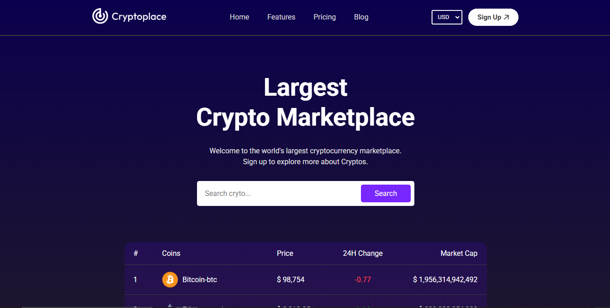
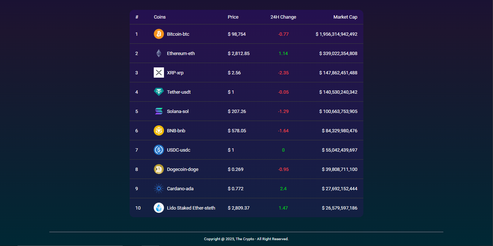
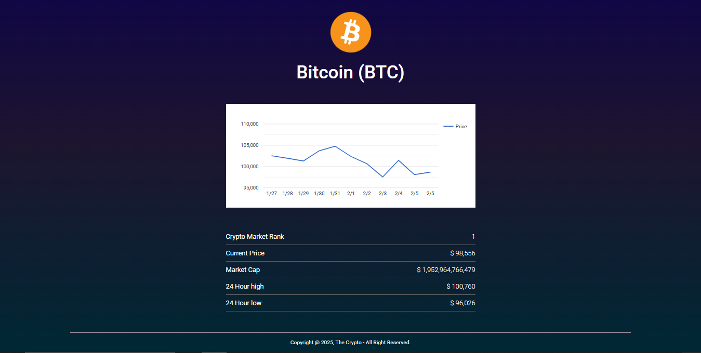

# 🚀 [the-Crypto](https://the-crypto.vercel.app/)


### Deployment: [the-crypto.vercel.app](https://the-crypto.vercel.app/)
---

## 📌 What is theCrypto?
A cryptocurrency tracking application developed using **React (frontend)** and **Node.js/Express (backend)**. This app retrieves real-time cryptocurrency data from the **CoinGecko API** and displays price charts with historical data.

## 🎨 theCrypto UI

### 🔹 Hero section:


### 🔹 Top cryptocurrencies:


### 🔹 Crypto Insights:


## ✅ Features
✔️ Real-time cryptocurrency market data  
✔️ Historical price charts using Google Charts  
✔️ Currency conversion (USD, EUR, etc.)  
✔️ Interactive and responsive UI  
✔️ Backend API built with Express.js  

## 🛠️ Tech Stack  

### **Frontend**  
- React.js  
- React Router  
- Context API  
- CSS  

### **Backend**  
- Node.js  
- Express.js  
- Axios  
- CoinGecko API  
- CORS  

---

## 🌍 Hosting Frontend (Vercel)  

1. **Install Vercel CLI:**  
   ```sh
   npm install -g vercel
   ```  
2. **Login to Vercel (if not logged in):**  
   ```sh
   vercel login
   ```  
3. **Deploy the frontend:**  
   ```sh
   vercel --prod
   ```  

---

## ☁️ Hosting Backend (Render)  

1. **Push the latest backend code to GitHub**  
2. **Go to [Render](https://dashboard.render.com) and create a new Web Service**  
3. **Connect your GitHub repository and select the backend directory**  
4. **Set the start command as:**  
   ```sh
   npm start
   ```  
5. **Deploy! 🚀**  

---

## 🔗 Live Demo  

🌍 **Frontend:** [the-crypto.vercel.app](https://the-crypto.vercel.app)  
📡 **Backend API:** `[https://thecrypto.onrender.com/]` (Replace with actual API URL)

